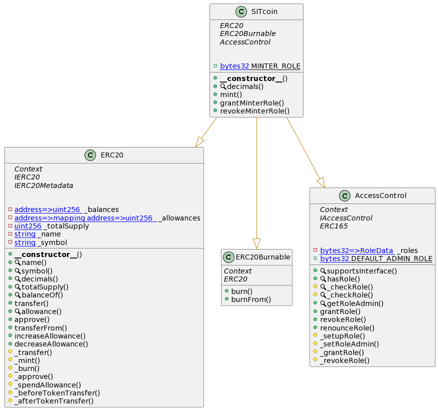
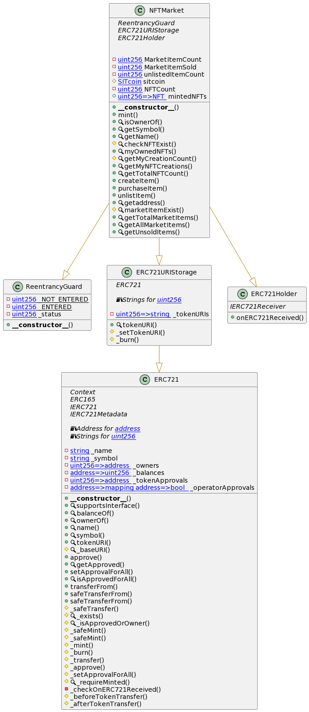
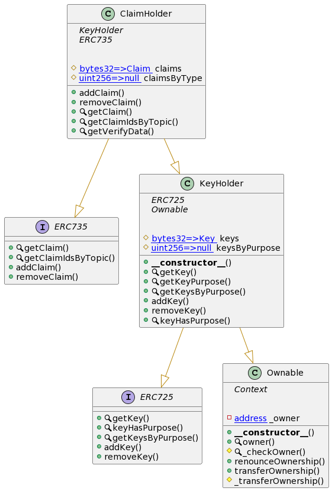

# SITCOIN Docs

## Documentation Generator
1. Ensure that `solidity-docgen` is installed to version **0.5.11**. If this project is cloned you can just run `npm i` to install dependencies.

2. Make sure that the `solc` is installed with alias `solc-0.8.6`.
```sh
npm i -D solc-0.8.6@npm:solc@0.8.6
```

3. Run the documentation script to generate the docs
```sh
npm run docify
```

## Editing Documentation Template
Edit the `contract.hbs` file in the `docgen/` folder to change the structure and generation of docs.
## UML Diagrams
### SITCOIN Token component:

### NFT Market component:

### Digital Identity component:

## Contract Documentation Links
* contracts
  * [ClaimHolder](docs/ClaimHolder.md)
  * [KeyHolder](docs/KeyHolder.md)
  * [Market](docs/Market.md)
  * [Migrations](docs/Migrations.md)
  * [NFTMarket](docs/NFTMarket.md)
  * [SITcoin](docs/SITcoin.md)
  * interfaces
    * [ERC725](docs/interfaces/ERC725.md)
    * [ERC735](docs/interfaces/ERC735.md)
