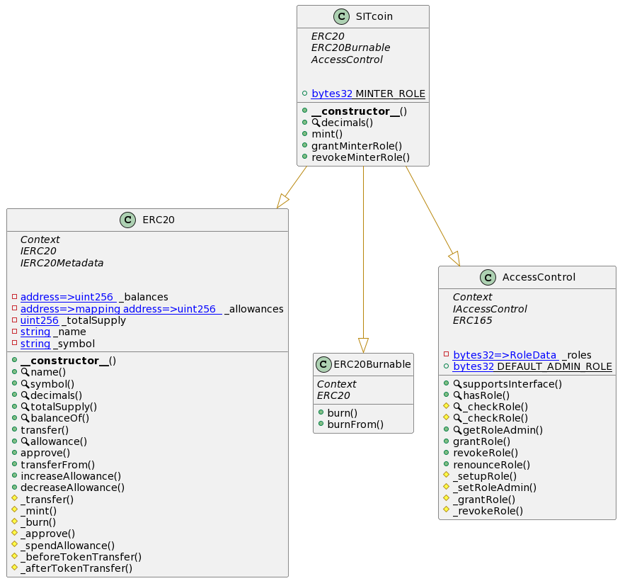
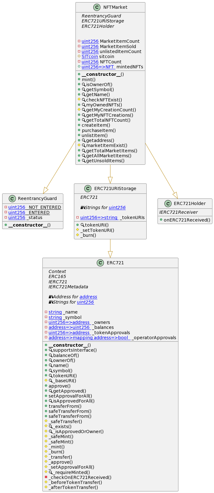
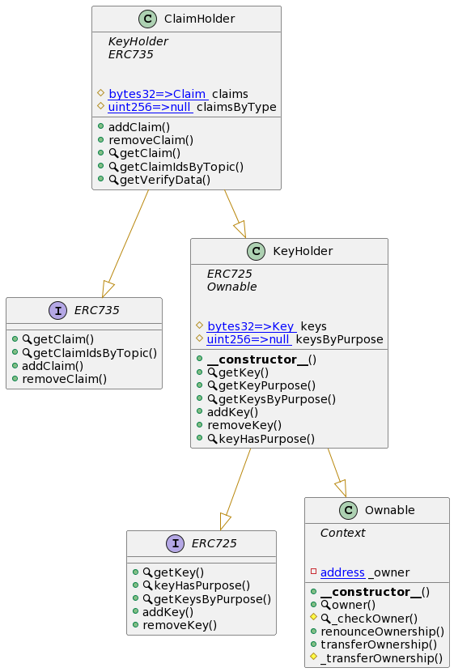

# SITCOIN Docs

This page documents the solidity contract files used to create the backend system for the SIT Coin project that runs on the PlatON blockchain. There are three main components:
- SITCOIN Token Component
- NFT Market Component
- Digital Identity Component

## Documentation Generator
1. Ensure that `solidity-docgen` is installed to version **0.5.11**. If this project is cloned you can just run `npm i` to install dependencies.

2. Make sure that the `solc` is installed with alias `solc-0.8.6`.
```sh
npm i -D solc-0.8.6@npm:solc@0.8.6
```

3. Run the documentation script to generate the docs
```sh
npm run docify
```

## Editing Documentation Template
Edit the `contract.hbs` file in the `docgen/` folder to change the structure and generation of docs.

## UML Diagrams


### SITCOIN Token component:


### NFT Market component:


### Digital Identity component:


## Contract Documentation Links

* contracts
  * [ClaimHolder](solidity-docs/ClaimHolder.md)
  * [KeyHolder](solidity-docs/KeyHolder.md)
  * [Market](solidity-docs/Market.md)
  * [Migrations](solidity-docs/Migrations.md)
  * [NFTMarket](solidity-docs/NFTMarket.md)
  * [SITcoin](solidity-docs/SITcoin.md)
  * interfaces
    * [ERC725](solidity-docs/interfaces/ERC725.md)
    * [ERC735](solidity-docs/interfaces/ERC735.md)
