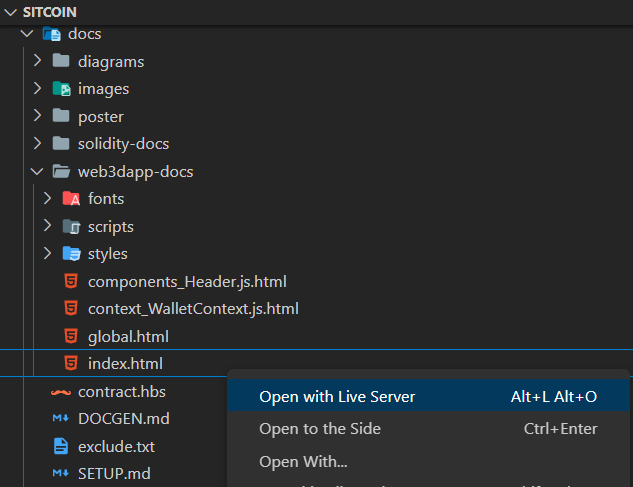

# SITCOIN Web3 dApp Documentation
This page documents the working PoC implementation of the use cases defined in the tokenomics that are chosen to be implemented. The use cases chosen from the tokenomics are:
1. Token Trading
2. Market
3. User Identity Verification

## Terminology
Each use case from the tokenomics are classified into a **feature** to be implemented in the UI. Under each feature, there are three things that enable the feature.

### Page
The `page` refers to file that the user is routed to when the server resolves the URL path. All `page` will not be documented as they are simply using the existing components to build the HTML to render.

### Component
The `component` can be inserted within pages to render the HTML that the component returns.

### Context
The `context` is the backend that provides the variables to be rendered. Each context state has a 'getter' and 'setter' function that helps set the states that are passed to the frontend to be rendered. The `context` also has event hooks that can detect changes in the variable state and refreshes the states when the event is triggered.

# Viewing documentation
1. Install [Live Server](https://marketplace.visualstudio.com/items?itemName=ritwickdey.LiveServer) on visual studio code
2. Navigate to the documentation folder (`docs/web3dapp-docs`)
3. Right click the `index.html` file
4. Select **"Open with Live Server"** option to open page in browser

# Generating documentation
The npm script has been prepared in the `package.json` file. All you need to do is run `npm run jsdoc` and check that the documentation is generated at `docs/web3dapp-docs`